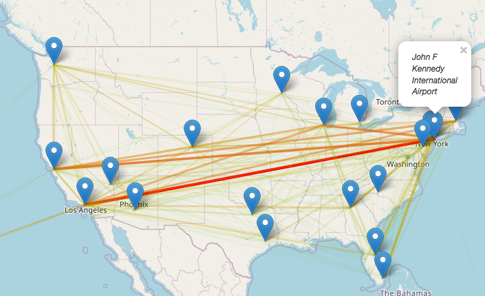

# US Air Traffic visualisation

This project is a side project that I led on my free time for fun, in order to play with geo data, maps, and data visualisation.

The goal was to plot the air traffic on a map. I limited myself only to the inner american flights (no international flights) be cause of the limited data that I found. Here is the final result that I obtained:

## The datasets

I used several datasets in order to complete this project:

* [Our Airports :](https://ourairports.com/data/) a website offering various data about airports, particularly the `aiports.csv` dataset, which is a list of all airports worldwide with their iata_code, gps coordinates...
* [2018 Airplane Flights - Kaggle :](https://www.kaggle.com/zernach/2018-airplane-flights) a list of all inner american flights of 2018. I renamed this file `flights.csv` for this project.
* [Busiest Airports by Passenger Traffic - Kaggle :](https://www.kaggle.com/jonahmary17/airports) a list of the 50 most busiests aiports by passenger traffic in the world per year between 2010 and 2016. I renamed this file `busiests.csv` for this project.

## The Notebook

This project is based on Python, an I used **Jupyter Notebook** to explore and compute the data. Look at the `Main.ipynb` file.

## Libraries

Here are the main Python libraries that I used:

* `Pandas` - easy datasets
* `Numpy` - math and arrays
* `Colour` - get some color gradients
* `Folium` - interactive maps
